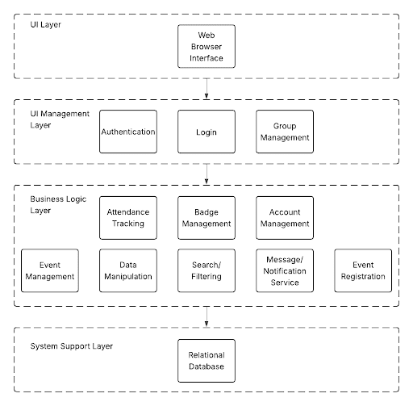
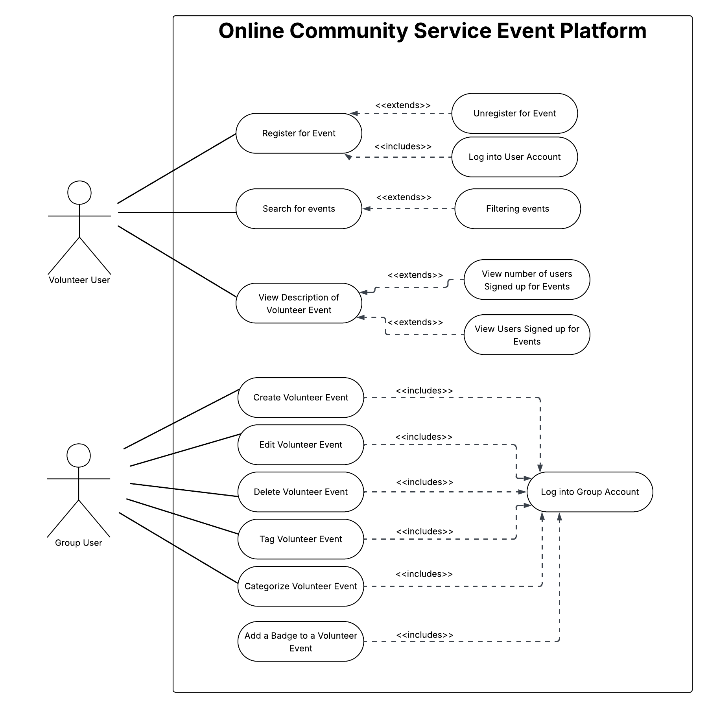

# PROJECT Design Documentation

> _The following template provides the headings for your Design
> Documentation.  As you edit each section make sure you remove these
> commentary 'blockquotes'; the lines that start with a > character
> and appear in the generated PDF in italics._

## Team Information

* Team name: all4all
* Team members
  * Noah Lago
  * Chris Shepard
  * Caleb Naeger
  * Lianna Pottgen

## Executive Summary

Our project is a community service event promotion application. The all4all app allows community service organizations to post their events for which volunteers can register. Organizations can set up events on the platform, providing information such as location, date and time, and event descriptions. This allows these groups to promote their events to a larger audience and track the registration metrics for their events. Groups will also be able to update their events if any details change. Volunteer users will be able to search for events by type or location and register for events they plan to attend. Users will also be able to follow organizations to receive notifications when those organizations add new events. Further, the app will include a badge system, where users will be rewarded for participating in events with displayable badges for their profile, adding another incentive for participation. 

## Requirements

This section describes the features of the application.

### Definition of MVP

Our Minimum Viable Product for all4all includes event management, event registration, event classification, organization accounts with basic authentication, volunteer accounts with basic authenticaiton. Users should be able to search, register, and unregister for events, and earn badges upon completion of an event. Organizations should be able to create, update, publish, and delete events. 

### MVP Features

- As a user/group, I want to be able to create an account in the platform, so that I can participate in the community service process
- As a user/group, I want to log into the platform with my username and password so that I can access my events.
- As a group, I want to be able to create or delete events, so that I can post them to the website to allow volunteers to register for them and remove any canceled events.
- As a group, I want to be able to read my events, so that I can review their descriptions and information.
- As a group, I want to be able to update my events, so that I can fix mistakes when needed.
- As a group, I want to categorize and tag events, to make it easier for interested users and volunteers to find my events. 
- As a user, I want to be able to register for an event, so that I can be a volunteer for an event
- As a user, I want to be able to unregister from an event, so that I can change my mind later on.
- As a group, I want to be able to see how many users are registered for my events, to have an estimated headcount ahead of the event’s start time. 
- As a user, I want to be able to search for events in my area/ZIP code, so that I can find events that I would be able to attend. 
- As a user, I want to be able to filter event searches by event categories, so that I can easily find the types of events that I’m interested in. 
- As a group, I want to be able to attach badges to my events so that users can feel rewarded for participating.
- As a user, I want to be able to collect badges from events, so that I can demonstrate the organizations I’ve worked with on my profile page. 

## Architecture and Design

This section describes the application architecture.

### Software Architecture
> _Place a architectural diagram here._
> _Describe your software architecture._

For our architectural pattern block diagram, we chose to do a layered architecture diagram. A layered architecture diagram most resembles our browser and how our data will flow in our program. This gives us the advantage to also see related functionality between layers so we are able to see functionality related between the UI, business logic, and the database. Additionally, this architecture allows our program to do future work and make changes easier. It is easier to swap out components and view how the functionality will change between parts of the system. 

### Use Cases
> _Place a use case diagram here._
> _Describe your use case diagram._

Our use case diagram demonstrates the use cases performed by both of our types of users. Based on our top MVP stories, we have a group/organization user and a volunteer user. Our volunteer users will be able to register for an event, unregister for an event, search for events, log into their accounts, create their account, view volunteering events, and can view the number of users signed up for the event. Additionally, group/organization users can create an organization account, log into their group account, create a volunteer event, edit a volunteer event, delete a volunteer event, tag a volunteer event, and categorize a volunteer event. These stories are represented in our use case diagram demonstrated below. 